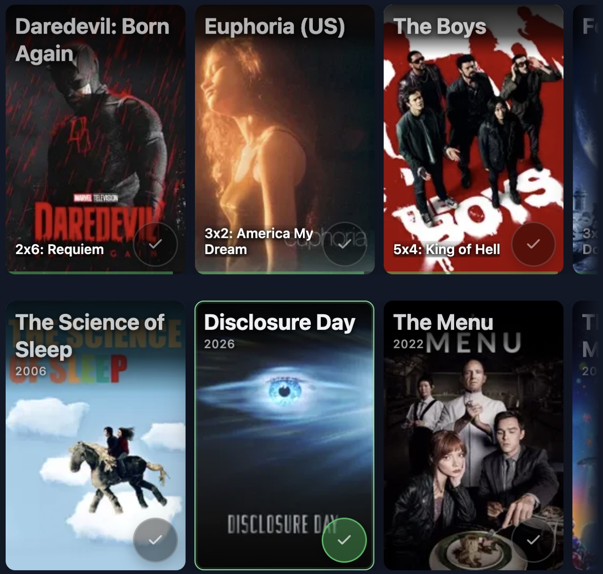
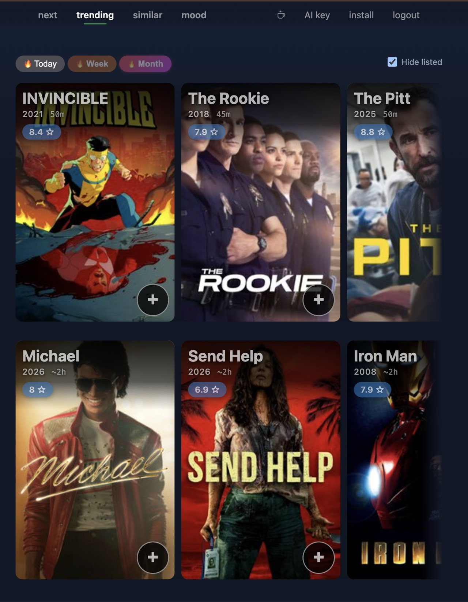
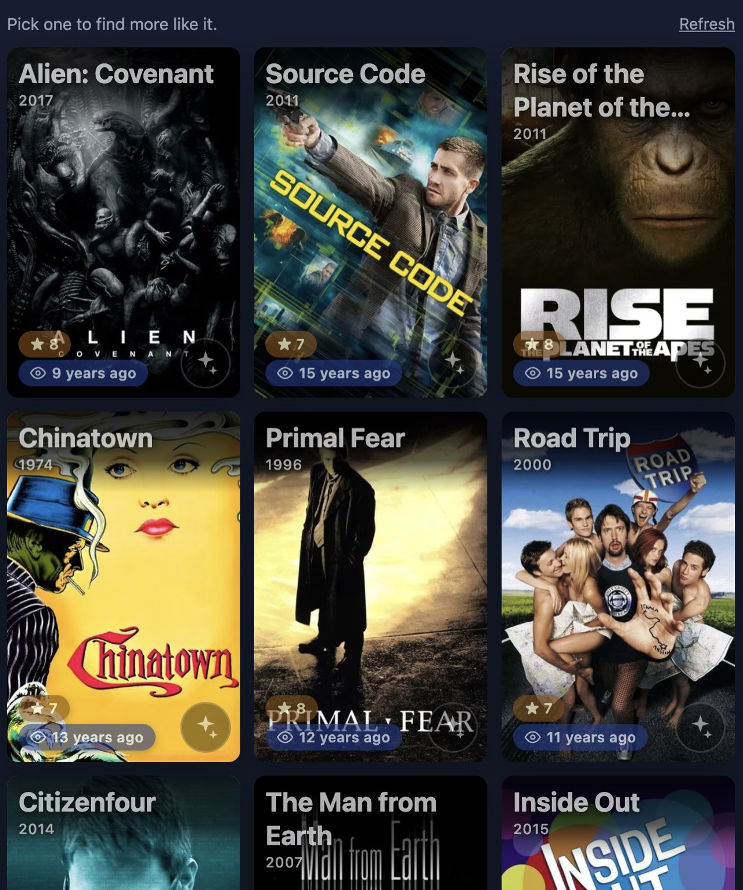
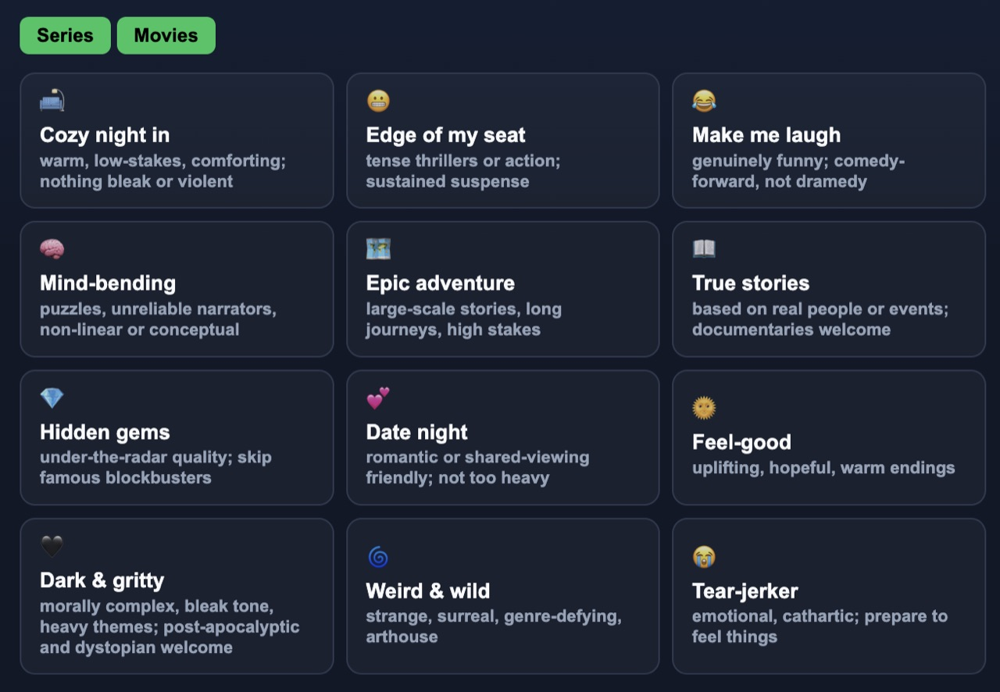

# Next Watch

A no-clutter companion for your [Trakt](https://app.trakt.tv) or [Simkl](https://simkl.com) library. Static app, no build step.

**Live:** <https://lsoares.github.io/simkl-next-watch/>

## Features

### Next
The exact episode you're on across every show you're watching — one tap to mark it watched.



### Trending
What's hot today, this week, this month. One tap to add to your watchlist.



### Similar
Pick a title you love; find more like it.



### Mood
AI-picked suggestions tuned to your ratings. Bring your own key (Gemini, OpenAI, Claude, Grok, Groq, DeepSeek, or OpenRouter).



## Setup

```sh
npm install
brew install ngrok   # only needed for `npm run expose`
```

## Commands

- `npm test` — run Playwright tests.
- `npm run build` — minify `index.html` and copy assets into `dist/`.
- `npm run expose` — serve on `:8080`, tunnel via ngrok, and open the developer pages so you can paste the ngrok URL as the redirect URI.

## Deploy

GitHub Actions builds on push to `main` and deploys `dist/` to GitHub Pages.
One-time setup: in repo Settings → Pages, set **Source** to **GitHub Actions**.

## Monitoring

[PostHog dashboard](https://us.posthog.com/project/202528/dashboard/491269) — pageviews and exception capture.
